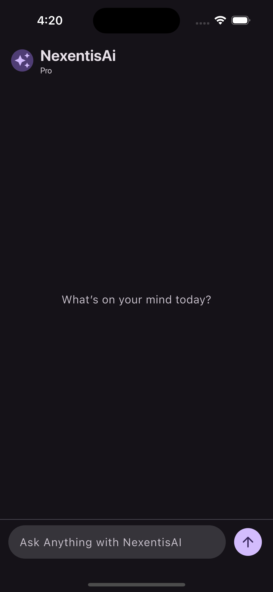

# Nexentis AI

Nexentis AI is a Flutter-based cross-platform AI chat application powered by Google Gemini.

[](https://flutter.dev/)
[](https://dart.dev/)
[](https://pub.dev/packages/flutter_bloc)


## [Live Preview]() 👀 [▶ Watch Demo Video](https://screenapp.io/app/v/qDZVF6XaCG)

</img> 
</img> 

## Overview

This app provides a clean chat-style interface where users can ask prompts and receive AI-generated responses.

Core flow:
- Splash screen animation
- Chat UI with user/assistant message bubbles
- Loading indicator while waiting for AI response
- Response rendering with animated typing effect

## Features

- AI chat powered by Gemini Generate Content API
- `Cubit`-based state management (`initial`, `loading`, `loaded`, `error`)
- Typewriter-style response animation
- Dark-mode-first Material 3 UI
- Multi-platform Flutter support (Android, iOS, Web, Windows, macOS, Linux)

## Tech Stack

- Flutter
- Dart
- `flutter_bloc`
- `http`
- `animated_text_kit`
- `gpt_markdown`

## Project Structure

```text
lib/
├── main.dart
└── bloc/
    ├── cubit/
    │   ├── search_cubit.dart
    │   └── search_state.dart
    └── ui/
        ├── splash_screen.dart
        └── home_screen.dart
```

## Getting Started

### Prerequisites

- Flutter SDK (stable)
- Dart SDK (included with Flutter)
- Android Studio / Xcode (for mobile targets)
- A valid Gemini API key

### 1) Install dependencies

```bash
flutter pub get
```

### 2) Configure Gemini API key

Current API integration is in:

`lib/bloc/cubit/search_cubit.dart`

Replace the hardcoded key with your own Gemini API key before running the app.

> Security note: Do not commit real API keys to source control. Prefer environment/config-based key injection for production.

### 3) Run the app

```bash
flutter run
```

Useful targets:

```bash
flutter run -d chrome
flutter run -d android
flutter run -d ios
```

## Build Commands

```bash
flutter build apk
flutter build ios
flutter build web
flutter build macos
flutter build windows
flutter build linux
```

## Troubleshooting

- If dependencies fail: run `flutter clean && flutter pub get`
- If no devices appear: run `flutter devices`
- If API calls fail: verify key validity, internet access, and endpoint access

## Author

- Bharti Sahu
- GitHub: [@bhartisahu09](https://github.com/bhartisahu09)

---

If this project helps you, consider giving it a star.
